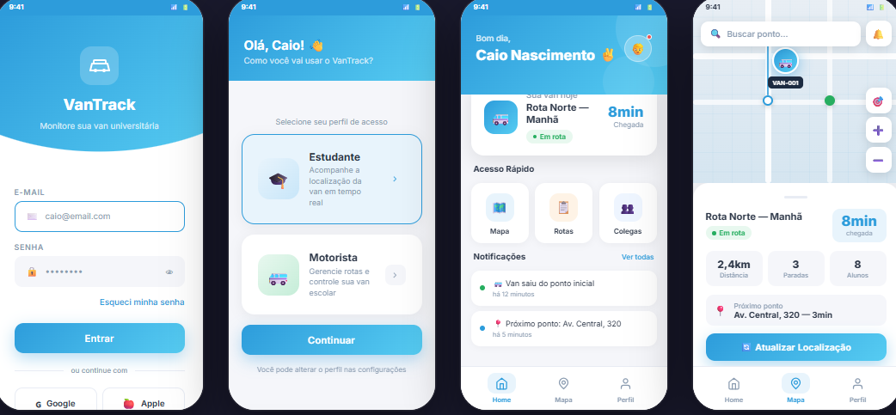
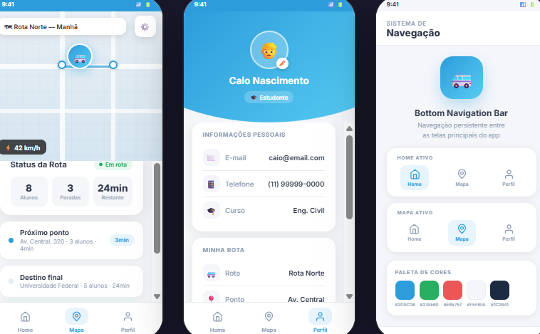

# 🚐 VanTrack - Monitoramento de Vans

Projeto de monitoramento de vans voltado para estudantes universitários, com foco em melhorar a organização, segurança e previsibilidade no transporte.

---

## 📍 Sobre o Projeto

O VanTrack é uma solução desenvolvida para facilitar o acompanhamento de vans utilizadas por estudantes. O sistema permite visualizar a localização do veículo, acompanhar rotas e verificar o tempo estimado de chegada, contribuindo para uma melhor experiência no deslocamento.

---

## ⚙️ Funcionalidades

- 📍 Localização da van em tempo real (simulada)  
- ⏱️ Tempo estimado de chegada  
- 🗺️ Visualização de rotas  
- 🔔 Alertas de status (em rota, atrasado, chegada)  

---

## 🚀 Como Funciona

O usuário acessa o aplicativo e pode acompanhar a localização da van, verificar o tempo estimado de chegada e visualizar a rota. As informações são atualizadas de forma simulada, permitindo demonstrar o funcionamento do sistema.

---

## 🎯 Objetivo

Melhorar a organização, segurança e previsibilidade no transporte de estudantes universitários.

---

## 🛠️ Tecnologias Utilizadas

- MIT App Inventor  
- CREAO
- Ferramentas Low-Code  
- Inteligência Artificial (apoio no desenvolvimento)  

---

## 📸 Protótipo

## Telas do Aplicativo

### Home

### Mapa

---

## 👥 Equipe

- Caio Nascimento  
- Lucas Vergili  
- Rafael Karne  
- Bruno Conti  
- Pedro Canaveze  

---

## 📚 Contexto Acadêmico

Este projeto foi desenvolvido com fins acadêmicos, com o objetivo de aplicar conceitos de desenvolvimento de sistemas, mobilidade urbana e uso de tecnologias para solução de problemas reais.

---

## 🔗 Repositório

Projeto disponível em:  
https://github.com/seu-usuario/vantrack

---
